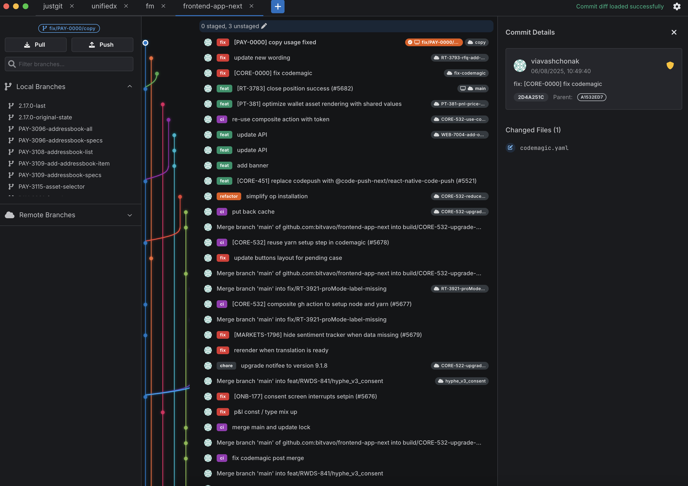
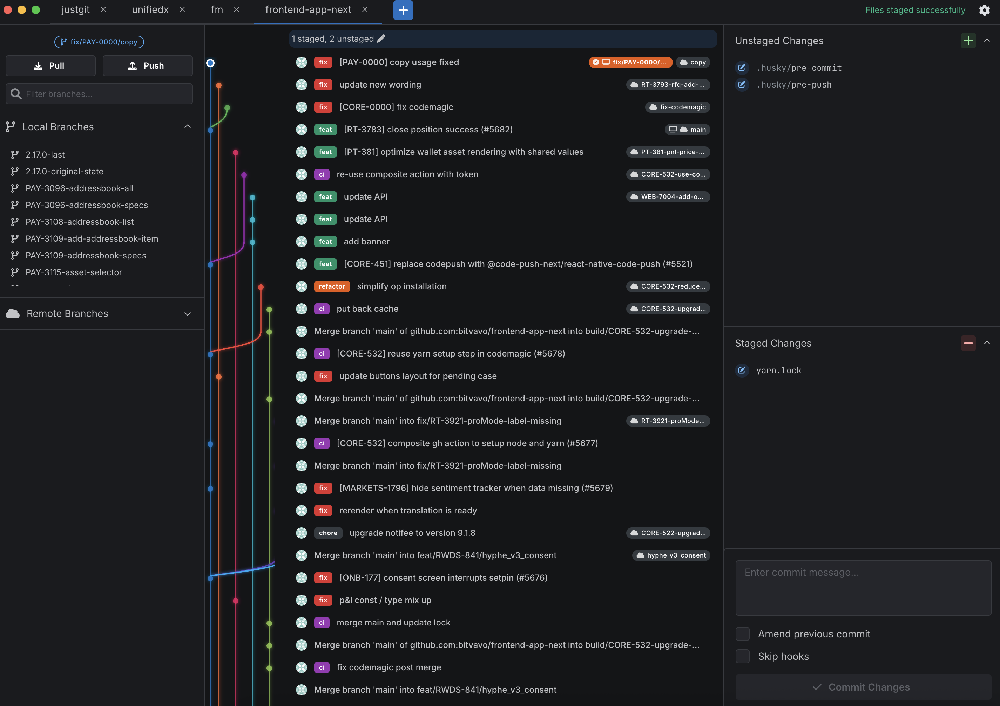

# justgit - lightweight git client

I am a paid GitKraken user and I really like it's UI/UX, however it's the the buggiest paid software I use and bloated with useless features, so I started to work on my own git client heavily inspired by GitKraken UX.

To use locally:

```
npm i
npm run dev
```

Note: it's in WIP phase and use it with your own risk. It's being developed for MacOS only but should work in windows/linux as well. PR's welcome!

## Screenshots


